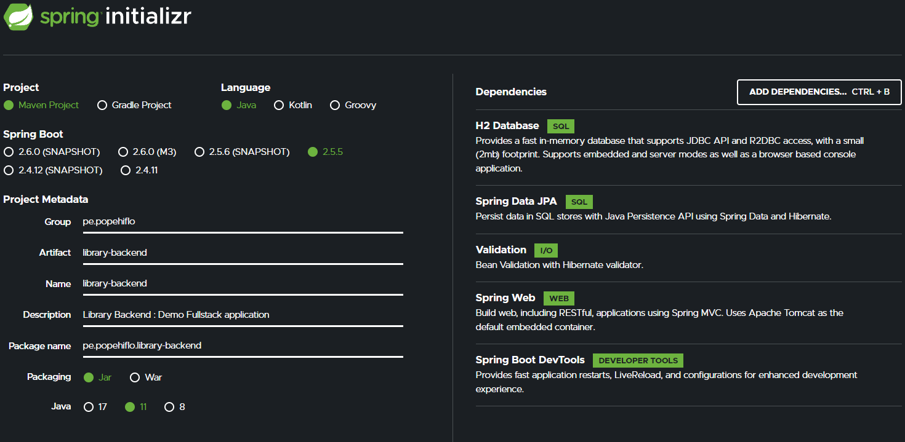

#  Library : Demo Fullstack application 📚
**Proyecto Web Fullstack**   
`H2`, `MySQL`, `JPA`, `Hibernate`, `Spring Boot`, `Spring Data JPA`, `TypeScript`, `Angular`.  
## Repositorio del backend [library-backend](https://github.com/popehiflo/library-backend) 👈
## Repositorio del frontend [library-frontend](https://github.com/popehiflo/library-frontend)   

## Backend Java construido con 🛠️
* [H2]() - Sistema administrador de BDs relacionales hecho con Java para entornos dev
* [MySQL]() - RDBMS
* [Java 11](https://www.oracle.com/java/technologies/downloads/#java11) - Java SE Development Kit 11
* [Spring Boot](https://spring.io/) - Convencion sobre configuración
* [Maven](https://maven.apache.org/) - Manejador de dependencias   

## Spring Initialzr 🛠️


## Running locally 🚀
Esta es una aplicación [Spring Boot](https://spring.io/guides/gs/spring-boot/) construida usando [Maven](https://spring.io/guides/gs/maven/). Se puede compilar y ejecutar desde la línea de comandos, depues de clonar el repositorio:  
```
cd library-backend
mvn spring-boot:run
``` 
Segun lo tenga configurado el path base sera `http://localhost:8080/`  
Request en Postman: **[Coleccion Request Postman](https://www.getpostman.com/collections/40b613de845222cba5f5)**
## Licencia 📄
¿Qué es eso? 😆     

         
⌨️ con ❤️ por [popehiflo](https://github.com/popehiflo) 😊
